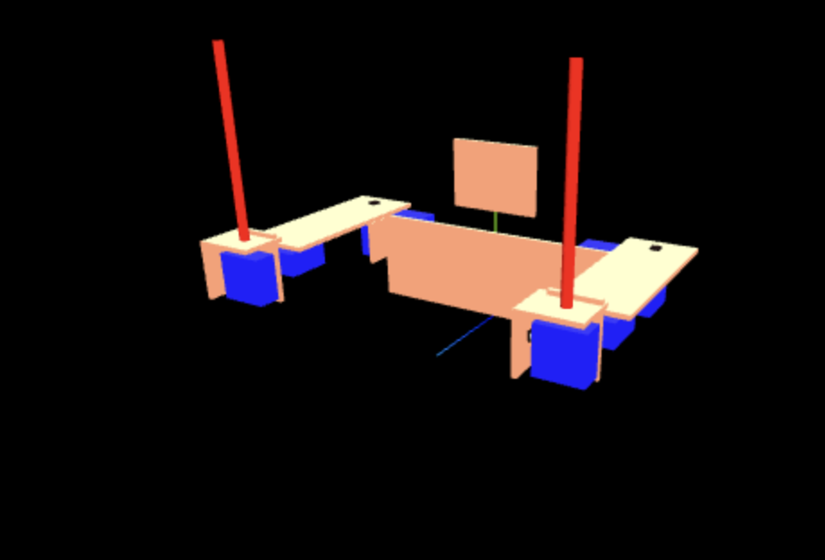
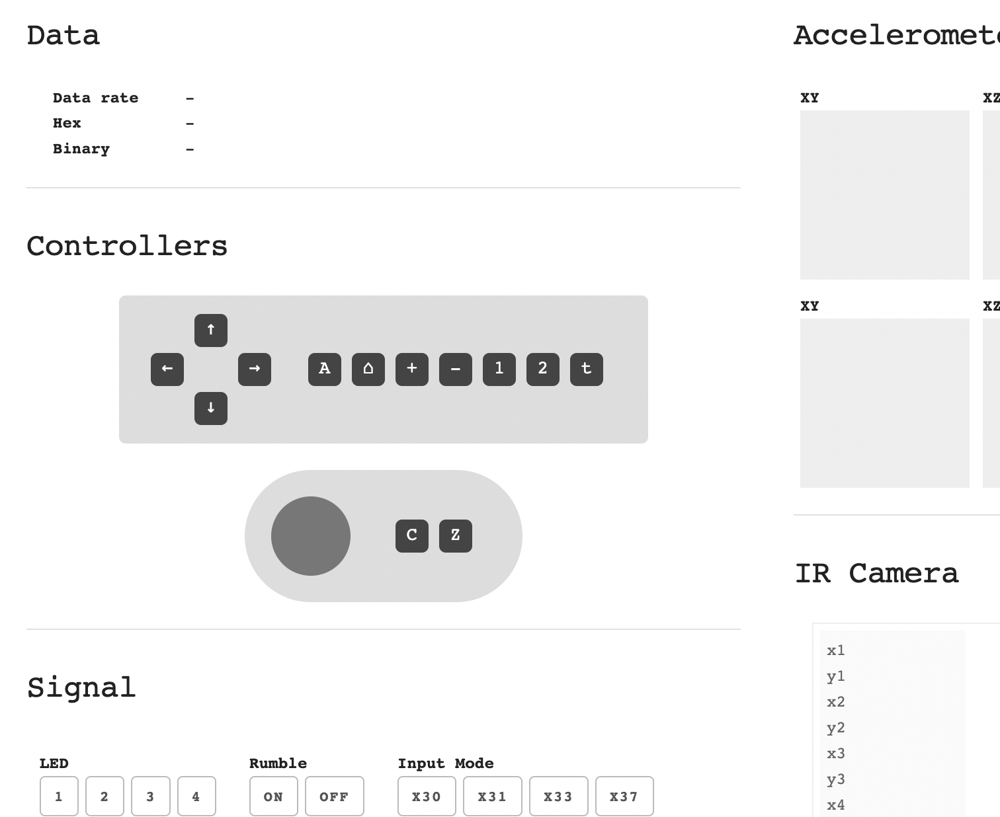
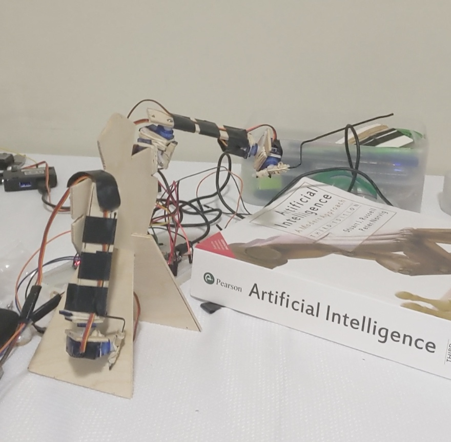

# The Shwii Bot

__A Wilmote Controlled Robot.__

---
To build the robot there are 4 parts.
- __The Server__ that connects to the Wiimote(Nintendo Wii Remote), Client and Arduino.
- __The Browser Interface__ aka __Client__. to get all the inputs, show them, simulate the robot in 3D, and send signal to the Arduino.
- __Arduino__ microprosser, and Arduino IDE to open the code, and upload it to your Arduino.
- __Hardwares__ 8 functional Servos, lots of wires, cardboard or wood for robot arms, breadboard, power supply, etc, - all of the physical components of your contraption robot.

If you're starting from scratch, the project takes about 4 hours. YMMV.

---
## Step 1: The server

First connect your Wiimote to your computer via bluetooth. This could be done by bluetooth device manager on your computer, and finding your Wiimote. Go to the `server` folder in a terminal and do a `npm install`. Then run the server with `npm start`. When Wiimote is detected, it should say `Wiimote Connected` on the server console log. The Arduino is however connected via serial port, and will need a server restart. More on Step 3.

## Step 2: The client
To setup the client go to you client folder in a terminal, and do a `npm install`. The client is written in React. Run the client with `npm start`, the Webapp should open on your browser at `http://localhost:3000`

On the Webapp, there are two tabs `Robot` and `Wiimote`. The `Robot` tab shows you the 3D representation of the Robot's intended state. At this point these should be functional.



The `Wiimote` tab will give you the view of the all the inputs that're coming from the wiimote.



Both of these should be functional at this point give you've successfully connected the server to the client and the wiimote.

## Step 3: Arduino
Open `ardunio/arduino.ino` file in your IDE. And connect your Arduino via serial port(USB). Upload the instructions in the ino files to your Arduino. Note: Server shouldn't be running while uploading.

### Important: The flow of data
The raw input from the Wiimote gets relayed directly into the browser client. The client then processes the input, and the position of servo data is relayed through server to Arduino.

The bulk of the logic is done on the client. And the server only acts as a relay between Wiimote to Client and Client to Arduino.

This done to drasticaly minimize the feedback-adjustment loop, and save time.

## Step 4: The Robot
In most Servos, there are 3 wires. Two power wires, and one PWM(pulse-width modulation) wire to send the position of the servo.

Connect the positive and negative power wires to the servo's `Ground` and `5V`. On the client, the `r0` to `r3` represents the right arm servos and `l0` to `l3` represents the left arm. The mapping to arduino's analog output ports for these arms, along with their range of motion could be found and modified here:

`https://github.com/ahamal/shwiibot/blob/master/client/src/Controller/Robot.js#L68`
```
    ['r0', 2, 0, 160],
    ['r1', 3, 160, 0],
    ['r2', 4, 0, 160],
    ['r3', 5, 0, 160],
    
    ['l0', 6, 0, 160],
    ['l1', 7, 160, 0],
    ['l2', 8, 0, 160],
    ['l3', 9, 0, 160]
```
Connect wood/cardboard and the servos into your robot.
---
When all of it is done, you should have a functional robot.

### Good luck!
View the video [here](./video.mp4)

